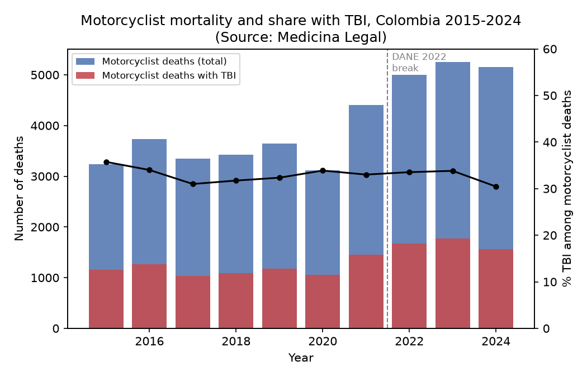
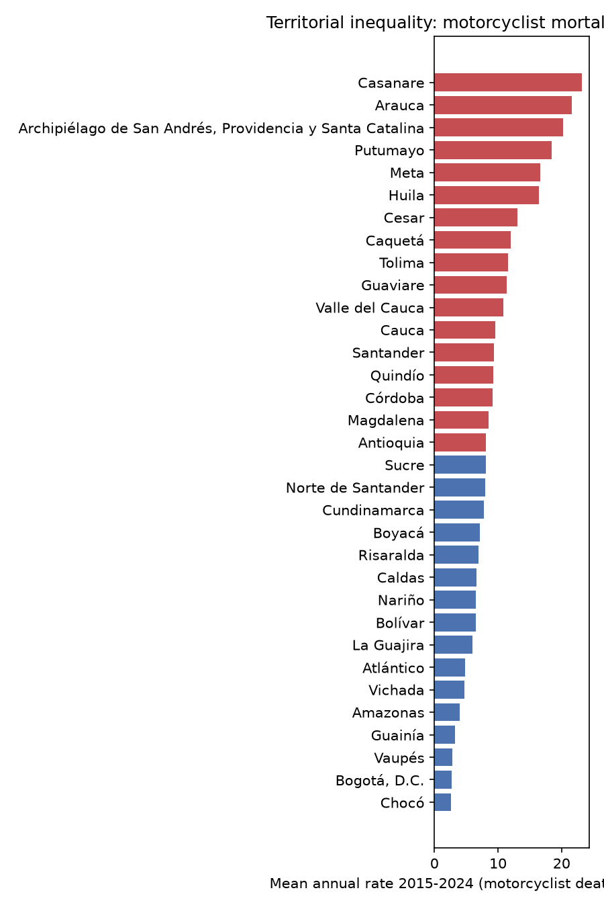
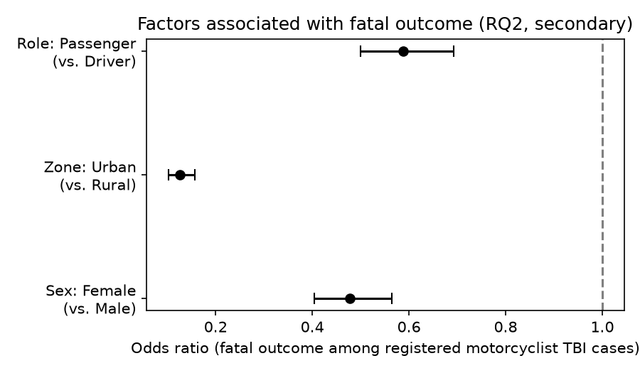
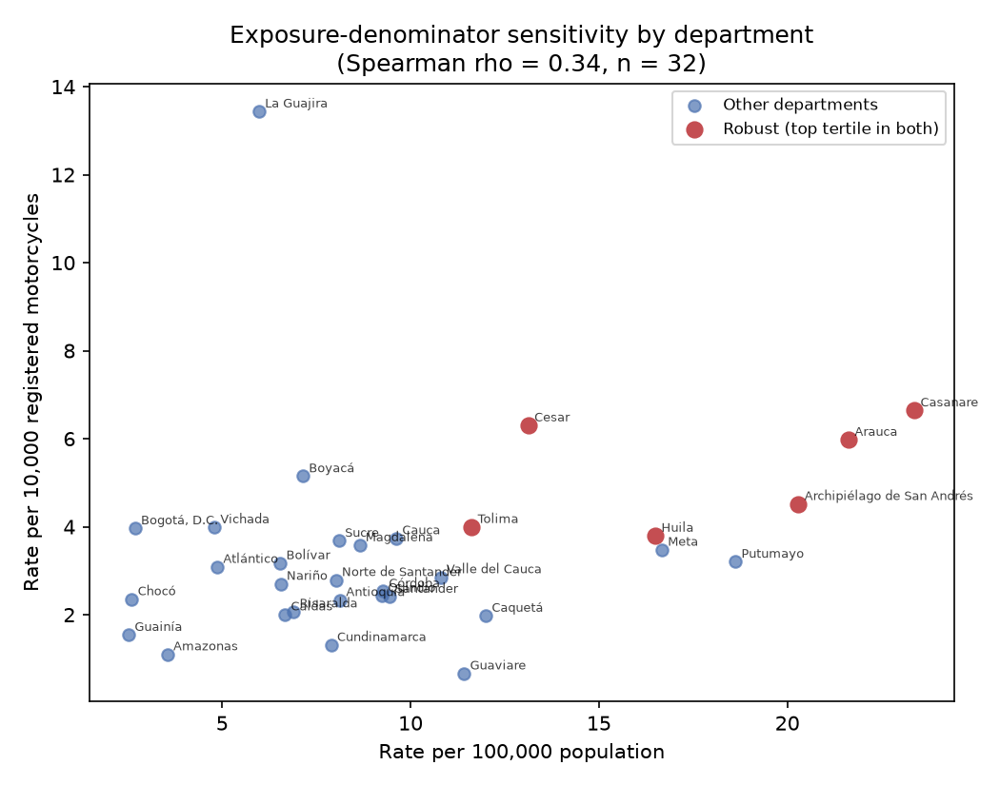

*Article*

# Traumatic Brain Injury Mortality Among Motorcyclists in Colombia, 2015–2024: National Trend, Territorial Inequality, and a Data-Comparability Warning for Vital Statistics Research

**Francisco Burgos-Florez ¹,\***

¹ Escuela de Pregrado, Dirección Académica, Vicerrectoría de Sede, Universidad Nacional de Colombia, Sede La Paz, Cesar, Colombia; fjburgosf@unal.edu.co

**\*** Correspondence: fjburgosf@unal.edu.co

---

## Abstract

**Background:** Motorcyclists are disproportionately represented among fatal road-traffic victims in Latin America, and traumatic brain injury (TBI) is a leading determinant of that mortality, yet Colombia lacks a national, decade-long, reproducible characterization; the only prior forensic-data study was restricted to a single city (Cartagena, 2007–2011). **Methods:** We analyzed two independent, open microdata sources—the National Institute of Legal Medicine and Forensic Sciences (Medicina Legal) fatal and non-fatal transport-injury registries (2015–2024; 40,318 motorcyclist fatalities) and DANE vital statistics coded with ICD-10 (external cause V20–V29; associated intracranial injury S06)—linked ecologically by department and year, modeling the national trend with negative binomial regression, territorial heterogeneity with a department-level model, and fatal-versus-non-fatal outcome with multivariable and Bayesian multilevel logistic regression. **Results:** TBI accounted for a stable 30–36% of motorcyclist fatalities throughout the period. TBI-specific national mortality increased (incidence rate ratio [IRR] = 1.035/year, 95% CI 1.009–1.062), closely tracking the all-motorcyclist trend (IRR = 1.041), but concentrated in 2022–2024 (pre-2022 non-significant), consistent with post-pandemic disruption. Departmental heterogeneity was pronounced—Casanare and Arauca showed rates nine times the lowest—and their elevated ranking held across both population- and motorcycle-fleet-based denominators, despite weak overall rank concordance (Spearman's ρ = 0.34). Fatalities concentrated overwhelmingly in young men (85.7% male; 48.1% aged 20–34) and drivers (81.4%); in a secondary, selection-bounded case-fatality analysis among registered cases (not interpreted as population lethality), female sex, urban location, and passenger role were associated with lower fatal proportions. Critically, DANE undercounted deaths by 10–25% before 2022 but converged within 2% afterward, after a documented civil-registry (Registraduría) integration that more than doubles the apparent trend (9.2% vs. 4.1%/year) by data source alone. **Conclusions:** This study delivers two contributions of comparable weight: the first national, decade-long, reproducible characterization of motorcyclist TBI mortality in Colombia, and a quantified, source-verified data-comparability warning for vital-statistics research in Colombia and similarly structured settings.

**Keywords:** traumatic brain injury; motorcyclists; road traffic injury; Colombia; Latin America; vital statistics; forensic epidemiology; territorial inequality; data comparability; helmet use

---

## 1. Introduction

Road traffic injuries remain a leading cause of death and disability worldwide, and low- and middle-income countries bear a disproportionate share of this burden [37–39]. Motorcyclists are among the most vulnerable road users in Latin America, where motorization has grown rapidly even as global helmet-use prevalence has declined over recent decades [11]. Traumatic brain injury (TBI) is one of the most severe and policy-relevant consequences of motorcycle crashes, contributing substantially to both mortality and long-term disability, including depressive and psychosocial sequelae documented in multi-site Latin American cohorts [35] and burdens on family caregivers [24]. Helmet use and type are known to modify both the occurrence and severity of head and facial trauma in motorcyclists [11,31], and vehicle- and infrastructure-level safety design has been modeled as a lever for reducing the regional road-injury burden [39], and engineering innovation continues on the helmet itself, including lattice-structure liners designed to mitigate oblique-impact head trauma [4].

Colombia illustrates this burden acutely. Motorcycles account for the majority of the national vehicle fleet, and motorcyclists represent the largest single category of road traffic fatalities in the country. A national clinical consensus on TBI management (the BOOTStraP protocol) was developed precisely because a large share of violent and road-traffic deaths in Colombia are TBI-related and because existing clinical practice guidance did not adapt well across the country's heterogeneous levels of care [34]. Colombian clinical series have documented TBI management and perioperative outcomes at the institutional level [44], factors associated with in-hospital mortality among moderate-to-severe TBI patients at a single southwestern-Colombia hospital [10], and TBI trends before, during, and after COVID-19 lockdowns at one referral hospital in the Orinoquía region spanning 2017–2021 [1] — the last of which explicitly notes that the pandemic's influence on TBI epidemiology in Colombia "remains largely unexplored" beyond the single-center level. A qualitative study of key informants further identified human, organizational, and policy barriers to road-traffic-collision and neurotrauma prevention in Colombia and called for further research [26]. Related Colombian work has examined alcohol's contribution to traffic injury and its healthcare costs in Bogotá [45], healthcare costs of road traffic accidents in Bucaramanga [21], maxillofacial trauma patterns in Medellín [23], pediatric trauma burden in Cali [48] and infant external-cause mortality nationally [46], interpersonal (non-traffic) injury risk factors using ecosocial framing [2], and other severe trauma case series such as blunt aortic injury [6] — together establishing that trauma epidemiology is an active Colombian research area, but not one that has yet produced a national, multi-year, TBI-specific, motorcyclist-specific characterization using open, reproducible data.

Despite this national activity, a 2020 narrative review of TBI due to road traffic across Latin America — searching PubMed, SCOPUS, and Google Scholar for studies published between 2000 and 2018 — identified only 17 eligible studies for the entire region and concluded explicitly that "the epidemiology of TBI due to road traffic in Latin America is not clearly documented" and that "more studies and registries are needed to properly document the epidemiological profiles of TBI related to RTAs" [36]. Regional reviews since have reiterated the need to reduce TBI incidence and mortality in Latin America through better-documented, system-level evidence [17]. The only study we identified that uses Colombian forensic data specifically to characterize fatal TBI is restricted to a single city, Cartagena, and to the period 2007–2011 [47] — thirteen years out of date and not nationally representative.

A substantial comparative literature from elsewhere in Latin America illustrates what a fuller regional picture of motorcyclist head trauma looks like: hospital-based clinical-epidemiological profiles of traffic-related TBI have been reported from the Brazilian Amazon [15] and from prospective, observational assessments of head injury in motorcyclists in Brazil more broadly [22], alongside general epidemiological profiles of motorcycle-accident victims at Brazilian university hospitals [38] and hospital-based injury-pattern studies in Ecuador [29] and Guatemala [12], and broader work examining factors associated with injury severity and functional outcome among hospitalized traffic-accident victims [14]. The wider regional trauma literature also documents diverse non-TBI presentations of motorcycle- and traffic-related injury, including vascular complications such as carotid dissection [8], craniocervical and craniomaxillofacial trauma [5,27,30,33], and ophthalmological injury [43] — illustrating the breadth of the clinical burden even where TBI-specific, population-level Colombian data remain scarce. Brazilian authors have also examined the direct impact of COVID-19 on traffic-accident epidemiology [20], and a separate letter to the editor has commented on COVID-19's impact on neurosurgical head-trauma referral and admission patterns [32] — both relevant comparators for the post-pandemic trend we describe below. Methodological and technological approaches to motorcyclist safety have also advanced regionally, including convolutional neural network-based automated helmet-use detection [13] and systematic reviews quantifying helmet-use prevalence worldwide [11] and its association with facial trauma severity [31].

A parallel and largely separate literature has documented territorial and social inequalities in Colombian road-traffic mortality using ecological and ICD-10-coded designs, both nationally [16,19] and, at a finer administrative grain, across urban and rural areas over two decades [19]. Multi-city comparative work across Latin America has begun to relate built-environment and social-context characteristics to motorcyclist mortality specifically [3,9], and regional burden-of-disease work has quantified mortality and disability-adjusted life years among motorcyclists across Latin America and the Caribbean over the first decade of the UN Decade of Action for Road Safety [18]. An openly published dataset of traffic accidents among motorcyclists in Bogotá [25] further illustrates that richer, city-level administrative data exist in Colombia even where national, TBI-specific, multi-year characterizations do not.

This study addresses three related but distinct research questions using two independent, publicly available Colombian data sources:

- **RQ1 (descriptive/ecological):** How has fatal TBI mortality among motorcyclists evolved nationally in Colombia between 2015 and 2024, and does it vary systematically by department?
- **RQ2 (descriptive + associational):** What is the demographic profile of motorcyclist head-injury fatalities (primary, using the near-complete fatal stratum), and — as a secondary, selection-bounded analysis — which factors are associated with a fatal rather than non-fatal outcome among forensically registered cases?
- **RQ3 (methodological):** Are Colombia's two principal national data sources for this outcome — the forensic (Medicina Legal) registry and the vital-statistics (DANE) registry — comparable over the full study period, and if not, what does that imply for their use in trend research?

RQ3 is not an ancillary robustness check but a co-primary aim of this study. Because Colombian and, more broadly, low- and middle-income-country road-safety research increasingly relies on these two administrative registries, the extent to which they agree — and the consequences of any mid-period change in their coverage — directly conditions the validity of the trend estimates that such research produces, including our own. We therefore treat the empirical characterization (RQ1–RQ2) and the data-comparability finding (RQ3) as two contributions of comparable weight.

Consistent with the exploratory nature of the available data (no individual-level linkage between sources is possible; see Section 2), we make no causal claims. We searched explicitly for a road-safety policy shock in Colombia between 2015 and 2024 that could support a quasi-experimental design (e.g., a helmet law, a passenger-restriction ordinance) and found none suitable: the 2022 national helmet-plate law changed only an administrative marking requirement, not helmet use itself, and municipal passenger-restriction decrees are confounded by their co-occurrence with public-order/crime interventions and are typically short-lived. We therefore restrict our inferential claims to the descriptive, ecological, and associational levels, and report this design decision transparently as part of the study's methodological contribution.

## 2. Materials and Methods

### 2.1. Data Sources

**Medicina Legal (National Institute of Legal Medicine and Forensic Sciences).** We used two publicly available, individual-level, de-identified microdata sets published via the Colombian open-data portal (datos.gov.co) through the Socrata API: fatal transport-event injuries (resource ID `s65h-7665`; n = 73,403 records, 2015–2024) and non-fatal transport-event injuries (resource ID `ezhf-hscf`; n = 342,796 records, 2015–2024). Both were downloaded in full (verified against the API's authoritative record count, correcting an initial pagination-limit truncation) and filtered to records with `medio_de_desplazamiento_o_transporte = "Motocicleta"`, yielding 40,318 fatal and 196,330 non-fatal motorcyclist records. TBI was defined, in this primary data source, as `diagnostico_topografico_de_la_lesión = "Trauma craneano"` — a topographic (body-region) classification, not a full clinical diagnosis or severity grade.

**DANE (National Administrative Department of Statistics) vital statistics.** We used the publicly available, anonymized non-fetal death microdata files for each year 2015–2024 (10 separate annual files, obtained via DANE's official microdata catalog). Motorcyclist status was defined using the ICD-10 underlying cause of death (`C_BAS1` ∈ V20–V29); TBI was defined using ICD-10 code S06 recorded as an associated cause. We identified and explicitly handled a structural change in how associated causes are recorded: files for 2015–2018 lack a unified associated-cause field and instead distribute this information across eleven separate variables, whereas files for 2019–2024 use a single consolidated field (`CAUSA_MULT`). Our extraction logic accounts for both formats (see code repository).

**Population denominators.** Departmental population by year (2015–2024) was obtained from DANE's official post-2018-census population projections (two complementary series covering 2005–2017 and 2018–2050), matched to case data using the standard national administrative code (DIVIPOLA).

### 2.2. Data Linkage and Its Limits

We verified that both Medicina Legal and DANE use the same geographic coding standard (DIVIPOLA, a 5-digit code combining a 2-digit department and 3-digit municipality identifier), confirming that **ecological linkage** (aggregation by department and year) is valid between the two sources. No individual-level linkage is possible: neither source contains a shared person-level identifier, and none was constructed or assumed. All cross-source comparisons in this study are therefore at the aggregate (year and/or department) level; no claim in this paper should be read as describing an individual-level relationship established by linking the two registries.

### 2.3. Case Definitions

TBI was defined using two independent, non-identical operational definitions, used deliberately as a sensitivity/triangulation strategy given the absence of any Colombian open-data source with clinical severity grading (e.g., Glasgow Coma Scale, as used in institutional decompressive-craniectomy series elsewhere [40]): (a) the Medicina Legal topographic classification "Trauma craneano" (primary definition, used for the trend, territorial, and lethality models), and (b) ICD-10 code S06 as an associated cause of death in DANE records (used for the methodological/sensitivity analysis in RQ3). Neither definition captures TBI severity or specific management pathways such as decompressive craniectomy [40] or tranexamic-acid administration [41]; this is a declared limitation, not an oversight (see Section 4.3).

### 2.4. Statistical Analysis

**RQ1 (trend and territorial heterogeneity).** We modeled annual fatal motorcyclist counts with negative binomial regression (dispersion parameter estimated by maximum likelihood, not fixed), with a log-population offset, and year (centered) as the predictor, reporting the incidence rate ratio (IRR). Because the study's focus is TBI specifically, we fit this trend model with two outcomes: the count of all motorcyclist fatalities and, as the outcome that matches the title and RQ1, the count of motorcyclist fatalities with recorded head injury ("Trauma craneano"). As a robustness check, we re-estimated each model restricted to 2015–2021 to test whether the trend was driven by the most recent years. Territorial heterogeneity was assessed with a Poisson model including department as a categorical predictor, compared to a reduced model via likelihood-ratio test; department-specific rates are reported descriptively (mean rate per 100,000 population, 2015–2024) as a complementary, non-model-based summary, given that the fixed-effects specification does not provide shrinkage for departments with small case counts (a declared limitation). Because population is an imperfect proxy for motorcycle exposure, we conducted a sensitivity analysis re-expressing departmental rates per 10,000 registered motorcycles, using the active motorcycle fleet by department from the national vehicle registry (RUNT2.0, dataset u3vn-bdcy, 2026 snapshot), and assessed the concordance of the two rankings with Spearman's rho; departments ranking in the top tertile under both denominators were flagged as robust. We interpret this analysis with explicit caution because RUNT counts vehicles by department of registration rather than circulation, which is known to distort exposure in registration-hub departments and in border departments with large informal fleets (see Section 4.3).

**RQ2 (demographic profile of fatalities and case-fatality among forensic cases).** Because the Medicina Legal non-fatal registry captures only injured motorcyclists who reach forensic examination — a selected subset — whereas fatal cases are near-completely ascertained through the legally mandated forensic necropsy of external-cause deaths, we treat these two sides asymmetrically and by design avoid interpreting their ratio as population lethality (see Section 4.3). Our **primary** RQ2 analysis is therefore descriptive and uses only the near-complete fatal stratum: we characterize the demographic and role distribution (sex, age group, urban/rural zone, driver/passenger role) of the 13,264 motorcyclist deaths with recorded head injury ("Trauma craneano"), a description that does not depend on the selected non-fatal sample and is thus free of the associated selection bias.

As a **secondary** analysis, we retain the case-fatality model on the full sample of 14,487 cases (13,264 fatal, 1,223 non-fatal), fit with multivariable logistic regression (sex, urban/rural zone, driver/passenger role, and year as covariates) and, as a secondary sensitivity check on residual geographic heterogeneity, a Bayesian mixed-effects logistic model with a department-level random intercept, but we explicitly rename its estimand as the **proportion fatal among forensically registered cases**, not population lethality, and report only the direction of associations. The mixed-effects model was estimated with the `BinomialBayesMixedGLM` implementation in `statsmodels`, fit by variational Bayes (mean-field approximation), with the package's default weakly informative independent normal priors on the fixed effects and a half-normal prior on the random-effect standard deviation; because variational Bayes yields an approximate posterior rather than Markov-chain samples, no chain-based convergence diagnostics (R-hat, effective sample size) apply, and we therefore treat this model only as a confirmatory sensitivity analysis for the sign and approximate magnitude of the department-level variance, not as a primary estimator. Its full specification and output are reported in the Supplementary Materials. To bound the potential impact of differential selection into the non-fatal sample, we conducted a quantitative selection sensitivity analysis: under a null of equal true lethality across groups, an observed case-fatality odds ratio would be fully explained by a differential forensic-ascertainment ratio equal to its reciprocal; we report, for each covariate, the magnitude of differential non-fatal ascertainment that would be required to nullify the observed association. The year coefficient is excluded from interpretation as a documented capture artifact (Section 4.3). Our covariate set reflects factors with documented relevance in the comparative literature (sex- and role-differentiated risk [15,22]; helmet use, which we could not measure directly in either source but which is well-documented as a severity modifier [11,31]; alcohol involvement, similarly not measurable in our sources but documented as relevant in Bogotá [45]).

**RQ3 (data comparability).** We compared annual motorcyclist-fatality counts from Medicina Legal and DANE independently (no individual-level merge), computing the year-by-year percentage difference, and separately re-estimated the RQ1 trend model using the DANE-based case definition to quantify sensitivity of the trend estimate to data source. Because the discrepancy between the two sources is concentrated at a single documented break (the 2022 DANE civil-registry integration; Section 3.4), we additionally re-estimated the DANE trend restricted to the pre-break window (2015–2021) and compared it against the corresponding Medicina Legal estimate over the same window. Convergence of the two sources within the pre-break window, combined with their divergence over the full series, isolates the 2022 coverage jump — a level shift in ascertainment — as the source of the full-series discrepancy, rather than a genuine difference in the underlying trend. We deliberately did not fit a full interrupted-time-series model with a slope-change interaction, because a national series of ten annual points with only three post-break years cannot support a stable interaction estimate; the pre-break restriction is the more defensible decomposition given the data.

**Falsification and robustness.** Following a prespecified falsification and robustness strategy (not a public preregistration), before accepting any model result we actively searched for evidence that could weaken or invalidate it. This process is what led us to identify and correct two internal methodological errors before finalizing results (an incorrectly fixed negative-binomial dispersion parameter, and an implausible year effect in the lethality model later traced to a genuine data-capture artifact — see Section 4.3) and to formally quantify the DANE–Medicina Legal discrepancy reported as our third research question. All statistical analyses were conducted in Python 3.12 using `statsmodels` 0.14.6.

### 2.5. Data and Code Availability

All data sources are publicly available (Medicina Legal via the Socrata open-data API; DANE via its official microdata portal). Analysis code, intermediate outputs, and full model summaries are maintained in a version-controlled repository organized to allow full reconstruction from raw data to figures (see Supplementary Materials).

## 3. Results

### 3.1. National Trend and TBI Share (RQ1)

Between 2015 and 2024, annual motorcyclist fatalities recorded by Medicina Legal rose from 3,234 to 5,152, with the proportion classified as TBI ("Trauma craneano") remaining relatively stable across the period (range 30.5–35.7%; Table 1, Figure 1). The negative binomial model estimated a statistically significant national increase in all-motorcyclist fatalities (IRR = 1.041 per year, 95% CI 1.018–1.065, p < 0.001). The TBI-specific trend model — the outcome that directly matches the title and RQ1 — closely tracked the all-motorcyclist trend (IRR = 1.035 per year, 95% CI 1.009–1.062, p = 0.009), as expected given the stable TBI share across the period. For both outcomes, however, the trend restricted to 2015–2021 was not statistically significant (all-motorcyclist IRR = 1.008, 95% CI 0.973–1.044, p = 0.667; TBI-specific IRR = 1.000, 95% CI 0.963–1.039), indicating that the overall increase is concentrated in 2022–2024 rather than reflecting a sustained linear trend across the full decade (Table 2). This post-2021 acceleration temporally coincides with reports elsewhere in the region of pandemic-related disruption to trauma systems and road-user behavior [1,20,32], although our design cannot establish a causal link.

**Table 1.** Descriptive characteristics of motorcyclist cases with recorded traumatic brain injury ("Trauma craneano"), Medicina Legal, Colombia, 2015–2024 (fatal + non-fatal pooled sample).

| Variable | N | % |
|---|---:|---:|
| **Total motorcyclist cases with TBI** | 14,487 | 100% |
| &nbsp;&nbsp;Fatal | 13,264 | 91.6% |
| &nbsp;&nbsp;Non-fatal | 1,223 | 8.4% |
| **Sex** | | |
| &nbsp;&nbsp;Male | 12,176 | 84.0% |
| &nbsp;&nbsp;Female | 2,311 | 16.0% |
| **Role** | | |
| &nbsp;&nbsp;Driver | 11,575 | 79.9% |
| &nbsp;&nbsp;Passenger | 2,912 | 20.1% |
| **Zone** | | |
| &nbsp;&nbsp;Municipal seat (urban) | 8,232 | 56.8% |
| &nbsp;&nbsp;Rural (hamlet and countryside) | 5,098 | 35.2% |
| &nbsp;&nbsp;Populated center (corregimiento, police inspection, hamlet) | 840 | 5.8% |
| &nbsp;&nbsp;No information | 317 | 2.2% |

**Figure 1.** National annual motorcyclist fatalities and the share classified as traumatic brain injury ("Trauma craneano"), Colombia, 2015–2024 (Medicina Legal fatal registry).

**Table 2.** Negative binomial trend model of annual motorcyclist fatalities (log-population offset, centered year), by outcome (all motorcyclist deaths vs. TBI-specific deaths), full series and robustness restriction.

| Outcome | Specification | IRR/year | 95% CI lower | 95% CI upper | p-value |
|---|---|---:|---:|---:|---:|
| All motorcyclist deaths | Full series 2015–2024 | 1.041 | 1.018 | 1.065 | < 0.001 |
| All motorcyclist deaths | Robustness: 2015–2021 only | 1.008 | 0.973 | 1.044 | 0.667 |
| TBI ("Trauma craneano") deaths | Full series 2015–2024 | 1.035 | 1.009 | 1.062 | 0.009 |
| TBI ("Trauma craneano") deaths | Robustness: 2015–2021 only | 1.000 | 0.963 | 1.039 | 0.991 |

### 3.2. Territorial Inequality (RQ1)

Department was a highly significant predictor of fatal motorcyclist counts after adjusting for population and year (likelihood-ratio test statistic = 8947.2, df = 32, p < 0.001). Descriptively, average annual fatality rates (2015–2024) ranged from approximately 23.1 per 100,000 population in Casanare and 21.6 in Arauca — both departments with substantial oil-sector economies and high motorcycle dependence — to approximately 2.5–2.7 per 100,000 in Chocó and the capital district, Bogotá (Figure 2). These departmental rates are computed on all motorcyclist fatalities; the TBI-specific departmental rates are almost perfectly rank-concordant with them (Spearman's ρ = 0.92, n = 33), so the territorial pattern described here is not an artifact of using all-motorcyclist rather than TBI-specific deaths as the numerator. This pattern of pronounced sub-national heterogeneity is directionally consistent with multi-city Latin American evidence linking built-environment and socioeconomic context to motorcyclist mortality [3,9] and with prior Colombian evidence of urban-rural and departmental inequality in road-traffic mortality generally [16,19].

**Figure 2.** Departmental average annual motorcyclist fatality rates per 100,000 population, Colombia, 2015–2024 (Medicina Legal fatal registry; DANE population projections).

The exposure-denominator sensitivity analysis showed that the overall departmental ranking was only weakly concordant between the population-based and motorcycle-fleet-based denominators (Spearman's rho = 0.34, n = 32; Supplementary Figure S1, Supplementary Table S1). Inspection of the discordant departments indicated that this reflected known artifacts of registration-based fleet data rather than epidemiological signal: La Guajira, a border department with a large informal motorcycle fleet not captured by the registry, rose to the highest per-motorcycle rate, while Bogotá and Cundinamarca shifted in opposite directions consistent with the registration of capital-district motorcycles in neighboring Cundinamarca municipalities. Critically, six departments — Casanare, Arauca, Cesar, Huila, Tolima, and San Andrés — ranked in the top tertile under both denominators, indicating that their elevated motorcyclist mortality is not an artifact of higher motorcycle density; Casanare and Arauca remained the two highest-rate departments on the population denominator and among the highest on the per-motorcycle denominator. We therefore retain the population-based rate as the primary measure and present the per-motorcycle rate as a triangulating robustness check.

### 3.3. Factors Associated with Fatal Outcome (RQ2)

**Demographic profile of fatalities (primary).** Among the 13,264 motorcyclist deaths with recorded head injury — a near-completely ascertained stratum — the burden was overwhelmingly concentrated in young men: 85.7% were male, and 48.1% were aged 20–34 years (modal group 20–24 years, 19.4%), with a right-skewed tail into older ages (Supplementary Table S2). Most decedents were drivers (81.4%) rather than passengers (18.6%). Fatalities were split between urban (54.1%) and rural (37.7%) locations, with 8.2% unspecified. This profile, which does not rely on the selected non-fatal sample, provides a bias-robust demographic characterization of who dies from motorcyclist head injury in Colombia.

**Case-fatality among forensic cases (secondary).** Among the full sample of 14,487 forensically registered motorcyclists with recorded TBI, 91.6% (13,264) were fatal; we stress that this proportion reflects the selective capture of non-fatal cases by forensic examination and must not be read as population lethality. In multivariable logistic regression, female sex (OR = 0.48, 95% CI 0.40–0.56), urban location (OR = 0.13, 95% CI 0.10–0.16), and passenger role (OR = 0.59, 95% CI 0.50–0.69) were each associated with a lower proportion of fatal outcome among registered cases (Table 3, Figure 3). Because these estimates are vulnerable to differential selection into the non-fatal registry, we bounded that threat quantitatively using the crude two-way contrasts (which is where the selection identity holds exactly): under a null of equal true lethality, the crude case-fatality associations would be fully explained by differential forensic ascertainment of non-fatal cases of approximately 7.9-fold for the urban–rural contrast, 3.1-fold for sex, and 2.5-fold for role (Supplementary Table S3). The urban–rural association is thus the most fragile — an eight-fold differential in non-fatal ascertainment between urban and rural areas is plausible given differential access to forensic services — whereas the sex and role associations would require implausibly large selection differentials to be entirely artifactual and are correspondingly more robust. Consistent with this, the associations were materially stable when the sample was split into 2015–2019 and 2020–2024 subperiods, except for the urban-zone effect, whose magnitude (but not direction) varied (see Section 4.3). The department-level random-intercept model (a variational-Bayes sensitivity analysis; Supplementary Table S4) confirmed substantial residual geographic heterogeneity after adjusting for individual covariates (posterior SD = 0.66, variational posterior interval 0.52–0.84).

**Table 3.** Multivariable logistic regression for fatal outcome among forensically registered motorcyclist TBI cases (estimand: proportion fatal among registered cases, **not** population lethality). Reference categories: Male, Rural, Driver.

| Variable | OR | 95% CI lower | 95% CI upper | p-value |
|---|---:|---:|---:|---:|
| Intercept | 31.76 | 25.40 | 39.70 | < 0.001 |
| Sex: Female (vs. Male) | 0.48 | 0.40 | 0.56 | < 0.001 |
| Zone: Urban (vs. Rural) | 0.13 | 0.10 | 0.16 | < 0.001 |
| Role: Passenger (vs. Driver) | 0.59 | 0.50 | 0.69 | < 0.001 |
| Year (centered) † | 1.22 | 1.20 | 1.25 | < 0.001 |

† The year coefficient is **not interpreted substantively**: it reflects a documented decline in non-fatal case capture over the period, not a genuine change in lethality (see Section 4.3).

**Figure 3.** Forest plot of adjusted odds ratios for fatal outcome among forensically registered motorcyclist TBI cases (secondary, selection-bounded estimand).

### 3.4. Data Comparability Between Sources (RQ3)

Comparing independently constructed annual motorcyclist-fatality counts, DANE undercounted relative to Medicina Legal by 9.6% to 24.9% in every year from 2015 through 2021, but the discrepancy fell to under 2% in each year from 2022 through 2024 (0.1–1.5%). We traced this discontinuity to a documented change in DANE's data-collection methodology: beginning with the 2022 annual database, DANE began directly integrating civil-registry (Registraduría Nacional del Estado Civil) death records that had not previously been captured through the health-sector-linked reporting system (RUAF-ND), specifically because those records involved no contact with the health sector. This is stated explicitly in DANE's own catalog documentation for the 2022 release. Consistently, re-estimating the RQ1 trend model using the DANE case definition (ICD-10 V20–V29 with associated S06) yielded a substantially steeper apparent trend (IRR = 1.092 per year, 95% CI 1.039–1.147) than the Medicina Legal-based estimate (IRR = 1.041), even though both sources agree on the direction of change. Crucially, when both trend models are restricted to the pre-break window (2015–2021), the two sources converge and are both flat: the DANE-based IRR falls to 0.989 (95% CI 0.935–1.047) and the Medicina Legal-based IRR is 1.008 (95% CI 0.973–1.044), neither statistically distinguishable from no trend. The full-series divergence between the two sources is therefore attributable to the 2022 level shift in DANE ascertainment, not to a genuine difference in the underlying trend — a decomposition that a single full-series comparison of the two IRRs would obscure.

## 4. Discussion

### 4.1. Principal Findings

This study provides, to our knowledge, the first national, decade-long, reproducible characterization of fatal TBI among motorcyclists in Colombia using open microdata, updating and substantially extending in geographic and temporal scope the only comparable prior forensic-data study, which was restricted to Cartagena and to 2007–2011 [47]. We show that the proportion of motorcyclist fatalities involving TBI has remained roughly stable over a decade even as absolute counts rose, that the recent rise is concentrated in the post-pandemic period rather than being a steady decade-long trend, that territorial inequality in motorcyclist mortality is large and persistent, and that the fatality burden is concentrated in young male drivers, with case-fatality among forensically registered cases patterned by sex, urban/rural location, and role (driver versus passenger) — the latter associations bounded explicitly for selection bias.

### 4.2. Comparison with Existing Literature

Our finding of pronounced territorial inequality is consistent with, and extends specifically to TBI, prior Colombian evidence of urban–rural and socioeconomic inequality in road-traffic mortality generally [16,19], and is broadly consistent with multi-city Latin American evidence relating environmental and social context to motorcyclist mortality [3,9], and with documented challenges of delivering timely TBI care in remote, resource-limited settings such as the Brazilian Amazon [28] — a parallel plausibly relevant to Colombia's own remote and rural departments. Our fatality profile — deaths overwhelmingly concentrated in young men and in drivers — and our secondary case-fatality associations among registered cases (lower fatal proportion for passengers than drivers, and for women than men) are consistent with the general pattern reported in comparative Latin American clinical-epidemiological studies of traffic-related TBI in Brazil [15,22,38] and Ecuador [29], and are plausible given known differences in exposure and crash mechanics between drivers and passengers, as well as the documented protective role of helmet use and type on head- and facial-injury severity [11,31]. We interpret the case-fatality associations cautiously in light of the selection-bounding analysis, which flags the urban–rural contrast in particular as sensitive to differential forensic ascertainment. Our single-center comparator, a recent Colombian study of TBI trends across the COVID-19 lockdown period at one referral hospital [1], is complementary rather than overlapping: that study explicitly notes that pandemic-related influence on TBI epidemiology "remains largely unexplored" beyond the single-center level in Colombia, which is precisely the gap our national analysis addresses; our finding of a post-2021 acceleration in national fatality counts adds indirect, population-level support to the single-center pandemic-disruption signal reported both in Colombia [1] and in a comparable Brazilian analysis of pandemic-era traffic-accident epidemiology [20], and echoes concerns raised elsewhere about COVID-19's disruption of neurosurgical head-trauma referral pathways [32]. The regional burden-of-disease literature situates our national estimates within a broader pattern of high motorcyclist mortality and disability-adjusted life years across Latin America and the Caribbean [17,18,37,39], while our data-comparability finding (Section 3.4) adds a Colombia-specific, quantified methodological caveat that we did not find addressed in any of the reviewed literature, including the most directly relevant national-inequality studies [16,19].

### 4.3. Threats to Validity and Falsification Checks

Consistent with the pre-specified falsification approach (Section 2.4), we report several limitations that were identified through active attempts to weaken our own conclusions, not merely acknowledged in retrospect.

First, the magnitude of the estimated national trend is sensitive to case definition: the DANE-based estimate (9.2%/year) is roughly twice the Medicina Legal-based estimate (4.1%/year), consistent with the coverage discontinuity documented in Section 3.4. We consider the Medicina Legal estimate more trustworthy for trend purposes, because it derives from a single institution's forensic examination process rather than a multi-source administrative registry subject to a documented mid-period methodological change; nonetheless, we report both estimates rather than presenting only the more favorable one.

Second, an initial specification of the negative binomial trend model used a fixed dispersion parameter (α = 1.0, a software default) rather than one estimated by maximum likelihood; we detected this before finalizing results and replaced it with the correctly estimated model (α = 0.011), which produced a narrower and more defensible confidence interval.

Third, in the lethality model, year was initially associated with an implausible odds ratio (1.22 per year, implying an approximately seven-fold increase in the odds of fatality over the study decade), a magnitude inconsistent with fatality rates already exceeding 85% in 2015. Investigation showed that the number of non-fatal cases captured by Medicina Legal declined from approximately 200 per year (2015–2018) to 60–90 per year (2020–2024) while fatal cases rose — a pattern of declining non-fatal case capture, not a genuine change in lethality, structurally analogous to the DANE coverage discontinuity described above. We therefore exclude the year coefficient from substantive interpretation in the lethality model and instead verified that the coefficients of primary interest (sex, zone, role) were stable when the sample was split into 2015–2019 and 2020–2024 subperiods; sex and role were stable, while the urban-zone effect varied in magnitude (though not direction) between subperiods, which we report as a moderate limitation rather than omitting it.

Fourth, neither of our two case definitions of TBI captures clinical severity (e.g., Glasgow Coma Scale, as documented in institutional series describing decompressive craniectomy [40] or tranexamic-acid protocols [41]); no Colombian open-data source currently provides this. Individual-level clinical severity data exist only in restricted sources (the RIPS health-records system, accessible only via formal request to the Ministry of Health) or in institutional trauma registries requiring institutional agreements, neither of which was accessible within the scope of this study. We similarly could not measure helmet use or alcohol involvement directly, both documented individual-level risk modifiers in the broader literature [11,31,45].

Fifth, no valid quasi-experimental design was identified for this period: we explicitly evaluated Colombia's 2022 national helmet-related law and municipal passenger-restriction ordinances as potential natural experiments and rejected both — the former altered only an administrative marking requirement rather than helmet use itself, and the latter are confounded by co-occurring public-order interventions and are typically short and intermittent. Consequently, all findings in this study should be interpreted as descriptive or associational; none supports a causal interpretation.

Sixth, the department-level territorial model uses fixed effects as a computational proxy rather than a full hierarchical model with shrinkage; department-specific rates for jurisdictions with small populations should be interpreted with appropriate caution.

Seventh, our primary territorial rates use resident population as the denominator, which does not account for between-department variation in motorcycle exposure. We addressed this with a per-registered-motorcycle sensitivity analysis (Section 3.2), but the available registry (RUNT2.0) assigns motorcycles by department of registration rather than circulation and does not capture informal fleets, so it cannot serve as a clean exposure denominator at the departmental level; no open Colombian data source provides motorcycle exposure by circulation, so this remains a bounded rather than fully resolved limitation. The convergent finding across both denominators — the robustly elevated position of Casanare and Arauca in particular — is the result we regard as denominator-independent.

### 4.4. Implications

For research practice, our third research question demonstrates concretely that a national vital-statistics registry in a middle-income country can undergo a substantial, poorly publicized coverage change that materially alters trend estimates — a finding with relevance beyond Colombia to any researcher using administrative mortality data with registry-linkage components across a multi-year panel, and a methodological contribution not addressed by prior Colombian inequality studies using similar registries [16,19]. For road-safety policy, the concentration of territorial risk in a small number of departments and the stability in the demographic composition of fatalities (concentrated among young men, drivers, and rural areas) point toward geographically and demographically targeted, rather than uniformly national, intervention design, complementing evidence-based approaches to vehicle and infrastructure safety design proposed regionally [39] and technology-assisted helmet-use enforcement [13].

### 4.5. Limitations

Beyond the threats to validity discussed above, this study is observational and ecological/associational in design; it cannot establish causal effects of any specific policy or behavior. The Medicina Legal non-fatal registry captures only cases that reach forensic examination and is not a complete census of non-fatal motorcyclist head injuries in Colombia, which biases any fatal-versus-non-fatal ratio if referral to forensic examination correlates with the covariates. We addressed this directly rather than relying on the ratio: our primary RQ2 result is a descriptive profile of the near-completely ascertained fatal stratum, which does not use the selected non-fatal sample; the case-fatality odds ratios are presented only as a secondary, explicitly relabeled estimand and are accompanied by a selection-bounding analysis (Section 3.3) that quantifies, for each covariate, the differential non-fatal ascertainment that would nullify the association. The 91.6% figure is a property of the forensic case mix, not a population lethality estimate, and is reported as such. We also note that Medicina Legal's registry reflects cases known to and processed by the forensic system and does not necessarily constitute an absolute national census of all deaths; the "near-complete" ascertainment we invoke for the fatal stratum should therefore be read as relative to the selected non-fatal stratum (fatal external-cause deaths require mandatory forensic necropsy, whereas non-fatal injuries reach the system far more selectively), not as a claim of exhaustive case capture. Our analysis also does not capture individual-level clinical management pathways (e.g., time-to-intervention, surgical decompression [40,42], pharmacological management of raised intracranial pressure [7], transfusion protocols [41]) documented in institutional case series elsewhere in the region, which remain outside the scope of a population-level forensic/vital-statistics study.

## 5. Conclusions

This study delivers two contributions of comparable weight. First, empirically, it provides the first national, reproducible, decade-scale characterization of fatal TBI among motorcyclists in Colombia using open microdata: a national increase concentrated in 2022–2024, a stable relative share of TBI among motorcyclist fatalities across the decade, pronounced and persistent territorial inequality (robust to the exposure denominator for the highest-burden departments), and a fatality burden concentrated in young male drivers (with case-fatality associations among forensic cases interpreted cautiously under explicit selection bounds). This updates a single-city forensic study now more than a decade old [47] and responds directly to the region-wide call for more studies and registries on this topic [36]. Second, methodologically, it demonstrates and quantifies a previously undocumented coverage discontinuity in Colombia's national vital-statistics registry — one that more than doubles the apparent annual national trend (9.2% vs. 4.1% per year) depending solely on the data source chosen — providing a concrete, source-verified warning directly relevant to any future study using these or structurally similar administrative mortality data. We regard this methodological finding as an equal, not subordinate, result: in settings where trend evidence drives road-safety policy, an unrecognized registry-coverage change can by itself manufacture or exaggerate a trend, and researchers must test for it explicitly.

---

## Supplementary Materials

The following supporting information is generated by the reproducible pipeline (`scripts/09b_runt_sensitivity.py`, `scripts/09c_rq2_profile_bounding.py`).

**Table S1.** Territorial exposure-denominator sensitivity: motorcyclist fatality rates per 100,000 population vs. per 10,000 registered motorcycles, by department, Colombia, 2015–2024. "Robust (top tertile in both)" flags departments in the top tertile under both denominators. Motorcycle fleet: RUNT2.0 (`u3vn-bdcy`, 2026 snapshot; by department of registration).

| Department | Deaths | Registered motorcycles | Rate /100k pop | Rate /10k moto | Robust (top tertile both) |
|---|---:|---:|---:|---:|:---:|
| Casanare | 1,014 | 152,633 | 23.38 | 6.64 | ✔ |
| Arauca | 570 | 95,368 | 21.63 | 5.98 | ✔ |
| Archipiélago de San Andrés | 126 | 27,897 | 20.30 | 4.52 | ✔ |
| Putumayo | 666 | 207,783 | 18.62 | 3.21 | |
| Meta | 1,784 | 512,961 | 16.67 | 3.48 | |
| Huila | 1,859 | 489,692 | 16.50 | 3.80 | ✔ |
| Cesar | 1,674 | 265,549 | 13.13 | 6.30 | ✔ |
| Caquetá | 492 | 248,701 | 12.00 | 1.98 | |
| Tolima | 1,567 | 392,288 | 11.63 | 3.99 | ✔ |
| Guaviare | 94 | 140,934 | 11.42 | 0.67 | |
| Valle del Cauca | 4,914 | 1,722,382 | 10.80 | 2.85 | |
| Cauca | 1,443 | 385,872 | 9.62 | 3.74 | |
| Santander | 2,119 | 879,352 | 9.43 | 2.41 | |
| Córdoba | 1,707 | 673,971 | 9.27 | 2.53 | |
| Quindío | 503 | 206,839 | 9.24 | 2.43 | |
| Magdalena | 1,211 | 338,229 | 8.65 | 3.58 | |
| Antioquia | 5,319 | 2,277,010 | 8.13 | 2.34 | |
| Sucre | 762 | 207,047 | 8.10 | 3.68 | |
| Norte de Santander | 1,251 | 448,457 | 8.02 | 2.79 | |
| Cundinamarca | 2,410 | 1,836,956 | 7.89 | 1.31 | |
| Boyacá | 885 | 171,886 | 7.14 | 5.15 | |
| Risaralda | 663 | 319,234 | 6.90 | 2.08 | |
| Caldas | 678 | 337,427 | 6.67 | 2.01 | |
| Nariño | 1,084 | 400,883 | 6.55 | 2.70 | |
| Bolívar | 1,386 | 436,887 | 6.54 | 3.17 | |
| La Guajira | 556 | 41,373 | 5.98 | 13.44 | |
| Atlántico | 1,280 | 414,440 | 4.87 | 3.09 | |
| Vichada | 57 | 14,289 | 4.79 | 3.99 | |
| Amazonas | 28 | 25,397 | 3.55 | 1.10 | |
| Bogotá, D.C. | 2,043 | 515,400 | 2.69 | 3.96 | |
| Chocó | 143 | 60,772 | 2.60 | 2.35 | |
| Guainía | 13 | 8,423 | 2.52 | 1.54 | |
| Vaupés | 6 | n/a | 1.41 | n/a | |

*Note:* The departmental "Deaths" column sums to 40,307; the 11-record difference from the national total of 40,318 motorcyclist fatalities corresponds to records without an assignable department of occurrence, which are included in national counts but cannot be placed in a departmental row. Vaupés has no RUNT motorcycle-fleet figure and is therefore shown without a per-motorcycle rate.

**Figure S1.** Territorial exposure-denominator sensitivity: departmental motorcyclist fatality rate per 100,000 population versus per 10,000 registered motorcycles (Spearman's rho = 0.34, n = 32).

**Table S2.** Demographic profile of motorcyclist head-injury fatalities (primary RQ2 analysis; near-complete fatal stratum, n = 13,264).

| Variable | Category | n (fatal) | % |
|---|---|---:|---:|
| **Sex** | Male | 11,372 | 85.7 |
| | Female | 1,892 | 14.3 |
| **Age group** | 20–24 | 2,568 | 19.4 |
| | 25–29 | 2,219 | 16.7 |
| | 30–34 | 1,595 | 12.0 |
| | 35–39 | 1,251 | 9.4 |
| | 40–44 | 987 | 7.4 |
| | 18–19 | 849 | 6.4 |
| | 45–49 | 796 | 6.0 |
| | 50–54 | 671 | 5.1 |
| | 15–17 | 642 | 4.8 |
| | 55–59 | 505 | 3.8 |
| | 60–64 | 414 | 3.1 |
| | 65–69 | 237 | 1.8 |
| | 10–14 | 165 | 1.2 |
| | 70–74 | 132 | 1.0 |
| | 75–79 | 74 | 0.6 |
| | 00–04 | 70 | 0.5 |
| | 05–09 | 46 | 0.3 |
| | 80 and over | 40 | 0.3 |
| | Fetus | 3 | 0.0 |
| **Zone** | Urban | 7,173 | 54.1 |
| | Rural | 5,004 | 37.7 |
| | Other/ND | 1,087 | 8.2 |
| **Role** | Driver | 10,793 | 81.4 |
| | Passenger | 2,471 | 18.6 |

**Table S3.** Selection-bounding analysis for the secondary case-fatality associations (RQ2). For each crude two-way contrast, the last column gives the differential forensic ascertainment of non-fatal cases that would, under a null of equal true lethality, fully explain the observed case-fatality odds ratio. f = fatal, nf = non-fatal counts by group.

| Contrast | Crude case-fatality OR | Non-fatal ascertainment ratio that would explain the OR | f (group 1) | nf (group 1) | f (group 2) | nf (group 2) |
|---|---:|---:|---:|---:|---:|---:|
| Sex: Female vs. Male | 0.319 | 3.13× | 1,892 | 419 | 11,372 | 804 |
| Zone: Urban vs. Rural | 0.127 | 7.86× | 7,173 | 1,059 | 5,004 | 94 |
| Role: Passenger vs. Driver | 0.406 | 2.46× | 2,471 | 441 | 10,793 | 782 |

Interpretation: an OR below 1 would be entirely explained if the injured in group 1 reached forensic examination the stated number of times more often than group 2, even with **equal** true lethality. The urban–rural contrast (7.9×) is the most susceptible to this explanation; the sex (3.1×) and role (2.5×) contrasts would require larger, less plausible differentials and are correspondingly more robust.

**Table S4.** Bayesian mixed-effects logistic model for fatal outcome among forensically registered motorcyclist TBI cases, with a department-level random intercept (RQ2 secondary sensitivity analysis). Estimated with `statsmodels` `BinomialBayesMixedGLM` by variational Bayes (mean-field approximation); coefficients are on the log-odds scale. Because variational Bayes yields an approximate posterior rather than Markov-chain samples, chain-based diagnostics (R-hat, effective sample size) do not apply. This model is reported only to confirm the sign and approximate magnitude of the residual department-level variance, not as a primary estimator.

| Parameter | Type | Posterior mean (log-odds) | Posterior SD |
|---|---|---:|---:|
| Intercept | Fixed | 3.636 | 0.033 |
| Sex: Female (vs. Male) | Fixed | −0.699 | 0.062 |
| Zone: Urban (vs. Rural) | Fixed | −2.143 | 0.035 |
| Role: Passenger (vs. Driver) | Fixed | −0.571 | 0.059 |
| Year (centered) † | Fixed | 0.205 | 0.007 |
| Department random-intercept SD | Variance | 0.660 (95% interval 0.516–0.844) | — |

† As in the fixed-effects model (Table 3), the year coefficient is not interpreted substantively (documented non-fatal capture artifact; see Section 4.3). The fixed-effect signs and magnitudes agree with the multivariable logistic model, and the department random-intercept SD (0.66) confirms substantial residual geographic heterogeneity after adjustment.

---

## Back Matter

**Supplementary Materials:** The following supporting information can be downloaded at [URL assigned by MDPI upon acceptance]: Figure S1 and Table S1 (territorial exposure-denominator sensitivity, deaths per registered motorcycle vs. per population); Table S2 (demographic profile of motorcyclist head-injury fatalities); Table S3 (RQ2 selection-bounding analysis); Table S4 (Bayesian mixed-effects model, RQ2 secondary). All supplementary items are generated by the reproducible pipeline (`scripts/09b_runt_sensitivity.py`, `scripts/09c_rq2_profile_bounding.py`, `scripts/09d_referee_revisions.py`).

**Author Contributions:** Conceptualization, methodology, software, validation, formal analysis, investigation, data curation, writing—original draft preparation, writing—review and editing, and visualization, F.B.-F. The author has read and agreed to the published version of the manuscript.

**Funding:** This research received no external funding.

**Institutional Review Board Statement:** Ethical review and approval were not applicable for this study, which relied exclusively on publicly available, de-identified secondary data — individual-level microdata published by the National Institute of Legal Medicine and Forensic Sciences and by DANE through the Colombian open-data portal, together with officially published aggregated population statistics — none of which can be traced to identifiable individuals. No new data were collected from human participants and no identifiable personal information was accessed.

**Informed Consent Statement:** Not applicable. The study used only anonymized, publicly available secondary records and did not involve any interaction with, or identifiable data of, human participants.

**Data Availability Statement:** All primary data are publicly available and were not generated by the author. Medicina Legal fatal and non-fatal transport-injury microdata are available via the Colombian open-data portal (datos.gov.co) through the Socrata API (resource IDs `s65h-7665` and `ezhf-hscf`). DANE vital-statistics death microdata and departmental population projections are available from the DANE portal. Registered-motorcycle counts are from the RUNT2.0 open dataset (`u3vn-bdcy`). All analysis code (data download, cleaning, variable construction, models, figures, and tables) is organized as a reproducible pipeline (`scripts/`) with a documented data dictionary and analysis log; it will be deposited in a public repository with a permanent DOI upon acceptance [repository URL/DOI to be inserted upon acceptance]. Access dates and full audit trail are recorded in `DATA_SOURCES.md`.

**Acknowledgments:** [Optional]

**Conflicts of Interest:** The author declares no conflicts of interest.

---

## References

1. Gomez-Niebles S., Osejo-Arcos V., Vergara-Garcia D., Aguilera-Pena M.P., Ibanez-Pinilla M., Aponte-Caballero R., et al. The Shifting Landscape of Traumatic Brain Injury After COVID-19: Prelockdown, Lockdown, and Postlockdown Trends: Data from a Referral Center in Colombia. *World Neurosurgery* 2026. https://doi.org/10.1016/j.wneu.2025.124667

2. Sanjuan J., García A.F., Gutiérrez-Martínez M.I., Villegas-Gomez G.A. Survival and Risk Factors in Interpersonal Injuries: A Secondary Ecosocial Study. *Journal of Surgical Research* 2026. https://doi.org/10.1016/j.jss.2025.12.014

3. Rodríguez S., Guerrero-Guevara L.F., Corzo-Forero J., León-Prieto C. Built environment and environmental determinants of neurological health: opportunities in Bogotá, Colombia. *Journal of Transport and Health* 2026. https://doi.org/10.1016/j.jth.2026.102286

4. Ramos H., Santiago R., Alves M. Gyroid lattice structure helmet liner for traumatic brain injury mitigation under oblique impact condition. *International Journal of Protective Structures* 2026. https://doi.org/10.1177/20414196261445999

5. Aponte-Caballero R., Osejo-Arcos V., Avellaneda L.C.C., Madrinan-Navia H., Fernando Rodríguez M.S., Riveros-Castillo W.M., et al. Traumatic Spinal Epidural Hematoma Associated with Cervical Nerve Root Avulsion without Vertebral Fractures: Case Report. *Turkish Neurosurgery* 2025. https://doi.org/10.5137/1019-5149.JTN.46720-24.2

6. Flórez de Moya H.Y., Montenegro-Apraez A.A., Barrera L.R.Q., Rojas W.E., Fernandez L.D.P., Trejos S.S. Endovascular Treatment of Blunt Aortic Trauma: First Colombian Case Series. *Journal of Endovascular Resuscitation and Trauma Management* 2025. https://doi.org/10.26676/jevtm.48940

7. Chong S.-L., Zhu Y., Wang Q., Caporal P., Roa J.D., Chamorro F.I.P., et al. Clinical Outcomes of Hypertonic Saline vs Mannitol Treatment among Children with Traumatic Brain Injury. *JAMA Network Open* 2025. https://doi.org/10.1001/jamanetworkopen.2025.0438

8. Modesto Dos Santos V., Modesto Dos Santos L.A., Plaça Tedeschi A. Internal carotid dissection after the motorcycle accidents. *Marmara Medical Journal* 2025. https://doi.org/10.5472/marumj.1629061

9. Yannone I.J., Alazraqui M., Rodriguez Hernandez J.L., Sarmiento Dueñas O.L., Rodriguez D.A., Pérez Ferrer C., et al. Built and social environment characteristics associated with motorcyclist mortality in Latin American cities from the SALURBAL study. *Injury Epidemiology* 2025. https://doi.org/10.1186/s40621-025-00611-y

10. Rivera Ordóñez A.C., Jojoa Cultid A.I., Mora Benitez D.A. Moderate and severe traumatic brain injury in a hospital in southwest Colombia: Clinical radiological factors related to mortality; [Trauma craneoencefálico moderado y severo en un hospital del suroccidente de Colombia: factores clínico-radiológicos relacionados con la mortalidad]. *Acta Neurologica Colombiana* 2024. https://doi.org/10.22379/anc.v40i2.1771

11. Shool S., Piri S.M., Ghodsi Z., Tabrizi R., Amirzade-Iranaq M.H., Mashayekhi M., et al. The prevalence of helmet use in motorcyclists around the world: a systematic review and meta-analysis of 5,006,476 participants. *International Journal of Injury Control and Safety Promotion* 2024. https://doi.org/10.1080/17457300.2024.2335509

12. Flores M., Reyna T., Quiñonez E., Mendoza J.A., Corzo V.F., Ortiz C., et al. Unsafe Practices of Motorcycle Riders in El Petén, Guatemala: A Community Observational Study and a Retrospective Institutional Review. *Journal of Surgical Research* 2024. https://doi.org/10.1016/j.jss.2024.04.084

13. Mercado Reyna J., Luna-Garcia H., Espino-Salinas C.H., Celaya-Padilla J.M., Gamboa-Rosales H., Galván-Tejada J.I., et al. Detection of Helmet Use in Motorcycle Drivers Using Convolutional Neural Network. *Applied Sciences (Switzerland)* 2023. https://doi.org/10.3390/app13105882

14. Canonica A.C., Alonso A.C., da Silva V.C., Bombana H.S., Muzaurieta A.A., Leyton V., et al. Factors Contributing to Traffic Accidents in Hospitalized Patients in Terms of Severity and Functionality. *International Journal of Environmental Research and Public Health* 2023. https://doi.org/10.3390/ijerph20010853

15. Ribeiro E.A., Ferreira R.H., Caixeta L.C., Fagundes M.J.L., de Jesus Weber L.K.B., Teixeira A.O. Clinical-epidemiological profile of traumatic brain injury associated with traffic accidents in southeastern Pará, in the Brazilian Amazon. *Medicina (Brazil)* 2023. https://doi.org/10.11606/issn.2176-7262.rmrp.2023.204038

16. Murillo-Hoyos J. et al. Deaths from traffic injuries and social inequality in Colombia, 2019. *Revista Panamericana de Salud Pública* 2023. https://doi.org/10.26633/RPSP.2023.121

17. Rivera-Lara L., Videtta W., Calvillo E., Mejia-Mantilla J., March K., Ortega-Gutierrez S., et al. Reducing the incidence and mortality of traumatic brain injury in Latin America. *European Journal of Trauma and Emergency Surgery* 2023. https://doi.org/10.1007/s00068-022-02214-4

18. Santiago M.L.O. et al. Mortality and disability-adjusted life years in motorcyclists in Latin America and the Caribbean during the first decade of action for road safety. *Revista Panamericana de Salud Pública* 2023. https://doi.org/10.26633/RPSP.2023.68

19. Montenegro-Martínez G., Arias-Castro C.E., Cardona-Arango D. Desigualdades sociales urbano-rurales en la mortalidad por siniestros viales en Colombia, 1998-2019. *Salud UIS* 2023. https://doi.org/10.18273/saluduis.55.e:23068

20. da Silva A.A., Ströher G.R., Teixeira H.M., Cordeiro M.V.G., Olandoski M., Von-Bahten L.C. Impact of the COVID-19 pandemic on the epidemiology of traffic accidents: a cross-sectional study; [Impacto da pandemia da COVID-19 na epidemiologia dos acidentes de trânsito: um estudo transversal]. *Revista do Colegio Brasileiro de Cirurgioes* 2022. https://doi.org/10.1590/0100-6991e-20223364-en

21. Carvajal R.R., Esteban A.N.P., Contreras C.C.T., Felipe R.E.E., González N.R., Muñoz C.C.M. Factors related to healthcare costs of road traffic accidents in Bucaramanga, Colombia. *Revista de Saude Publica* 2022. https://doi.org/10.11606/s1518-8787.2022056003299

22. Below C., Brianti I.C., Parreira J.G., Lucarelli-Antunes P.S., Saade N., Golin M., et al. Clinical assessment of head injuries in motorcyclists involved in traffic accidents: A prospective, observational study; [Investigação da presença de lesões traumáticas em segmento cefálico em motociclistas vítimas de acidentes de tráfego: Estudo observacional prospectivo]. *Revista do Colegio Brasileiro de Cirurgioes* 2022. https://doi.org/10.1590/0100-6991E-20223340

23. Agudelo-Suárez AA, Duque-Serna FL, Restrepo-Molina L, et al. Epidemiology of maxillofacial fractures due to traffic accidents in Medellín, Colombia. *Gaceta Sanitaria* 2022. https://doi.org/10.1016/j.gaceta.2015.04.007

24. Juengst S.B., Perrin P.B., Klyce D.W., O'neil-Pirozzi T.M., Herrera S., Wright B., et al. Caregiver Characteristics of Adults with Acute Traumatic Brain Injury in the United States and Latin America. *International Journal of Environmental Research and Public Health* 2022. https://doi.org/10.3390/ijerph19095717

25. Ospina-Mateus H., Berrio Garcia S., Quintana Jiménez L., Salas-Navarro K. Dataset of traffic accidents in motorcyclists in Bogotá, Colombia. *Data in Brief* 2022. https://doi.org/10.1016/j.dib.2022.108461

26. Selveindran S.M., Samarutilake G.D.N., Vera D.S., Brayne C., Hill C., Kolias A., et al. Prevention of road traffic collisions and associated neurotrauma in Colombia: An exploratory qualitative study. *PLoS ONE* 2021. https://doi.org/10.1371/journal.pone.0249004

27. Batista A.V.S., Aguiar G.B., Bennett P., Umigi M.R., Veiga J.C.E. Observational study of patients with occipital condyle fracture at a brazilian referral trauma center; [Estudo observacional de pacientes com fratura de côndilo ocipital em centro de referência em trauma no brasil]. *Revista do Colegio Brasileiro de Cirurgioes* 2021. https://doi.org/10.1590/0100-6991e-20213024

28. Paulino Campos M.C., Venzel R., Pessoa de Oliveira L., Reis F., Oliveira de Amorim R.L. Management of Traumatic Brain Injury at a Medium Complexity Hospital in a Remote Area of Amazonas, 2017–2019. *World Neurosurgery* 2021. https://doi.org/10.1016/j.wneu.2020.12.088

29. Siteneski A., Jalca Cantos L.D., Calderón Delgado E.P., Yaguache Celi R.M., Silva Saltos C.A., Zamora A., et al. Injury patterns among road traffic accidents: A hospital-based study in Ecuador. *Bionatura* 2021. https://doi.org/10.21931/rb/2021.06.02.710.21931/

30. Nogueira E.F.C., de Souza R.R.L., de Menezes L.P., Lopes P.H.S., Brasil Júnior O., Vasconcellos R.J.H. Reconstruction of extensive sequel of frontal fracture: Optimizing results; [Reconstrução de extensa sequela de fratura frontal: Otimizando resultados]. *Brazilian Dental Science* 2021. https://doi.org/10.14295/bds.2021.v24i4.2587

31. Cavalcante D.K.F., Veloso S.R.M., Durão M.D.A., Melo V.D.C., Monteiro G.Q.D.M., Porto G.G. Do Helmet Use and Type Influence Facial Trauma Occurrence and Severity in Motorcyclists? A Systematic Review and Meta-analysis. *Journal of Oral and Maxillofacial Surgery* 2021. https://doi.org/10.1016/j.joms.2021.02.028

32. Pérez-García V., Amaris-Pérez A., Escobar-Pacheco C., Ramos-Díaz A., Lozada-Martínez I.D. Letter to the editor regarding "The impact of COVID-19 on neurosurgical head trauma referrals and admission at a tertiary neurosurgical centre". *Journal of Clinical Neuroscience* 2021. https://doi.org/10.1016/j.jocn.2021.05.070

33. Rêgo I.C.Q., Vilarinho S.M.M., Rodrigues C.K.F., Correia P.V.D.A.R., Junqueira J.L.C., Oliveira L.B. Oral and cranio-maxillofacial trauma in children and adolescents in an emergency setting at a Brazilian hospital. *Dental Traumatology* 2020. https://doi.org/10.1111/edt.12515

34. Rubiano A.M., Vera D.S., Montenegro J.H., Carney N., Clavijo A., Carreño J.N., et al. Recommendations of the Colombian Consensus Committee for the Management of Traumatic Brain Injury in Prehospital, Emergency Department, Surgery, and Intensive Care (Beyond One Option for Treatment of Traumatic Brain Injury: A Stratified Protocol [BOOTStraP]). *Journal of Neurosciences in Rural Practice* 2020. https://doi.org/10.1055/s-0040-1701370

35. Cariello A.N., Perrin P.B., Agudelo Y.R., Olivera Plaza S.L., Quijano-Martínez M.C., Trujillo M.A., et al. Predictors of longitudinal depression trajectories after traumatic brain injury in Latin America: A multi-site study. *NeuroRehabilitation* 2020. https://doi.org/10.3233/NRE-192972

36. Dunne J., Quiñones-Ossa G.A., Still E.G., Suarez M.N., González-Soto J.A., Vera D.S., et al. The Epidemiology of Traumatic Brain Injury Due to Traffic Accidents in Latin America: A Narrative Review. *Journal of Neurosciences in Rural Practice* 2020. https://doi.org/10.1055/s-0040-1709363

37. James S.L., Lucchesi L.R., Bisignano C., Castle C.D., Dingels Z.V., Fox J.T., et al. Morbidity and mortality from road injuries: results from the Global Burden of Disease Study 2017. *Injury Prevention* 2020. https://doi.org/10.1136/injuryprev-2019-043302

38. Bittar C.K., Júnior A.C., da Costa V.S.D.A., de Freitas Pacheco A.C., Ricci R.L. Epidemiological profile of motorcycle accident victims in university hospital. *Acta Ortopedica Brasileira* 2020. https://doi.org/10.1590/1413-785220202802230035

39. Bhalla K., Gleason K. Effects of vehicle safety design on road traffic deaths, injuries, and public health burden in the Latin American region: a modelling study. *The Lancet Global Health* 2020. https://doi.org/10.1016/S2214-109X(20)30102-9

40. Silva A.C.V., De Oliveira Farias M.A., Bem L.S., Valença M.M., De Azevedo Filho H.R.C. Decompressive Craniectomy in Traumatic Brain Injury: An Institutional Experience of 131 Cases in Two Years. *Neurotrauma Reports* 2020. https://doi.org/10.1089/neur.2020.0007

41. Tencza E., Harrell A.J., Sarangarm P. Effect of tranexamic acid administration time on blood product use in urban trauma patients. *American Journal of Health-System Pharmacy* 2020. https://doi.org/10.1093/ajhp/zxaa074

42. Pereira R.M.A., Barbosa O.C., Basílio A.F., Santana A.C., De Paula D.M., Marangon H., Jr. Surgical decompression of the orbit due to frontal bone and roof of the orbit fractures - A case report. *Annals of Maxillofacial Surgery* 2020. https://doi.org/10.4103/ams.ams_87_20

43. Munayco-Guillen F., Muro-Mansilla P., Velasco-Stoll J., Zavala-Loayza J.A., Camara-Reyes R.R. Post-traumatic eyeball luxation; [Avulsion postraumatics de globo ocular]. *Revista Mexicana de Oftalmologia* 2020. https://doi.org/10.24875/RMOE.M20000098

44. Fernández L.M.G., Ortiz-Velásquez L.A., Casas-Arroyave F.D. Management and perioperative outcomes of traumatic brain injury: retrospective study. *Colombian Journal of Anesthesiology* 2019. https://doi.org/10.1097/CJ9.0000000000000112

45. Gómez-Restrepo C., Naranjo-Lujan S., Rondón M., Acosta A., Maldonado P., Arango Villegas C., et al. Latin American Clinical Epidemiology Network Series – Paper 6: The influence of alcohol in traffic accidents and health care costs of it in Bogotá-Colombia. *Journal of Clinical Epidemiology* 2017. https://doi.org/10.1016/j.jclinepi.2016.10.003

46. Rosselli D., Carlier J.C., Lozano M.A., Murcia L.H., Amaya A.F., del Río-McMahon R. Death from external causes in infants in Colombia 2005-2013; [Muertes de causa externa en menores de cinco años en Colombia 2005-2013]. *Revista Chilena de Pediatria* 2017. https://doi.org/10.4067/S0370-41062017000400004

47. Tuñón-Pitalua M.C., Ortiz-Pinto M.A. Caracterización epidemiológica del trauma craneoencefálico fatal en Cartagena, Colombia, 2007-2011. *Colombia Forense* 2016. https://doi.org/10.16925/cf.v3i1.1586

48. Cleves D., Gómez C., Dávalos D.M., García X., Astudillo R.E. Pediatric trauma at a general hospital in Cali, Colombia. *Journal of Pediatric Surgery* 2016. https://doi.org/10.1016/j.jpedsurg.2016.01.008
